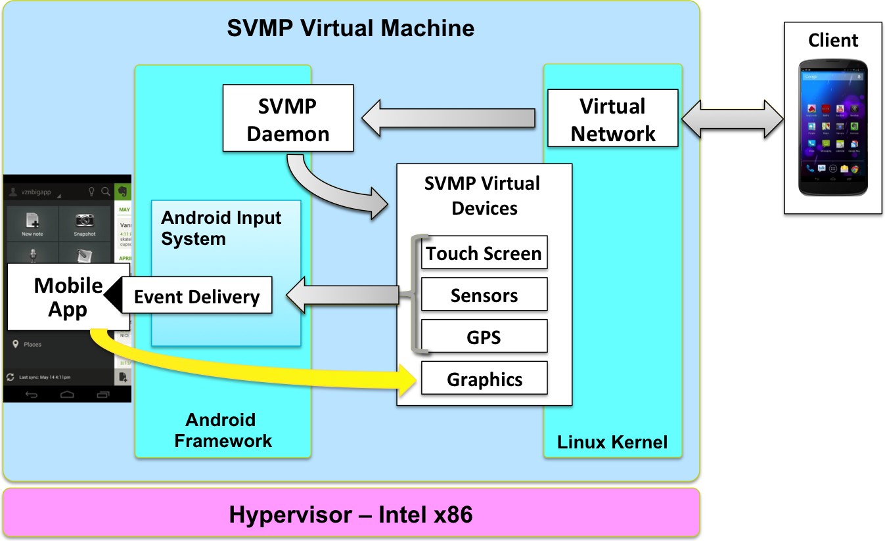

# 系统设计与架构

[TOC]

## 云应用架构

SVMP在很大程度上依赖于云API来管理虚拟智能手机设备的生命周期。这使我们可以轻松地适应各种不同的部署环境。在较高的层面上，它类似于传统的面向桌面的瘦客户端系统。它还具有类似于XMPP或SIP等IP语音和视频服务的元素，因为我们通过WebRTC重用其中几种技术来传输远程桌面视频和音频数据。

主要组成部分是：

- 用户手机或平板电脑上的客户端应用程序
- 该SVMP监工来处理身份验证，数据库同治，以及虚拟机部署
- 客户端连接的SVMP服务器
- 虚拟设备“黄金映像”和每用户持久数据卷集
- 提供底层云API的云控制器

 此外，可以在实现中使用可选的反向代理/负载平衡器。

## 客户端应用

当用户开始与远程设备交互时，相似性结束。SVMP客户端不是模拟鼠标和键盘，而是捕获原生触摸屏事件，传感器输入（如加速度计和陀螺仪），映射应用程序的位置信息，以及用于通知弹出窗口和[意图](https://developer.android.com/training/basics/intents/index.html)的一些双向应用程序间消息传递。这使得与远程移动应用程序的交互方式与本地应用程序相同，使用手势，如捏和滑动，倾斜和旋转，获取GPS位置，甚至让应用程序启动其他应用程序（例如，拨打电话号码或打开URL） 。

所有这些输入都打包成[SVMP协议消息](..\other\SVMP有线协议.md)并发送到服务器。

客户端还与虚拟设备创建WebRTC对等连接。来自虚拟设备的视频和音频输出流回该链路并播放给用户，完成循环。

### SVMP监督员

该SVMP监督者是系统的第一个面向互联网的成分。这就是你的DMZ上发生的事情。

它负责接收来自用户的登录请求，对数据库或外部身份服务执行身份验证，以及在云上创建和管理虚拟机。它运行RESTful API，客户端和SVMP服务器可以访问。它还包括用于管理用户和HTML5客户端的Web控制台。

### SVMP服务器

该SVMP服务器是系统的第二个面向互联网的成分。这也适用于您的DMZ。

它负责接收已经与监督员进行过身份验证的用户的连接请求，通过监督者启动虚拟机部署，以及将客户端连接的输入消息路由到在虚拟设备内运行的SVMP守护程序。

服务器旨在实现模块化和可扩展性，因此可以在负载均衡器后面运行多个实例，以便为大量并发用户提供服务。

### 虚拟设备映像

此映像封装了虚拟智能手机设备的核心操作系统，包括内核，启动文件和Android框架服务。不同的云和虚拟化平台以不同的方式处理此映像，例如，OpenStack中的Glance映像或Amazon EC2上的AMI。

### 用户数据卷

用户数据卷为用户的“漫游配置文件”提供存储。这些通常由云基础架构提供的块存储卷（例如OpenStack Cinder，Amazon EBS）支持。

这些卷用于`/data`基于Android的虚拟设备中的文件系统树。Android具有将该用户的所有数据，已安装的应用程序，设置和首选项保存在此文件系统中的有用属性，从而可以轻松打包并将此数据从一个虚拟设备移动到另一个虚拟设备。

### 云控制器

云控制器不是SVMP软件的一部分，但在SVMP系统中起着重要作用。该SVMP服务器配置了凭据，允许它在底层的云基础架构进行虚拟机的创建，删除和维护操作。

当需要创建新的虚拟电话VM时，SVMP服务器向云控制器发出请求以创建从当前设备映像克隆的新VM。它还命令控制器将用户的数据卷附加到新创建的实例。当用户注销并且VM空闲时，SVMP服务器最终告诉云控制器删除该实例以为将来的连接腾出空间。

## 虚拟设备结构

AOSP可以在开箱即用的x86处理器上编译和运行，但它缺少任何与远程交互的方法。SVMP添加了一组虚拟输入设备，视频流输出和一些其他自定义功能，以实现丰富的远程访问体验。

主要组成部分是：

- 中央SVMP守护进程
- 触摸屏输入注入
- 虚拟传感器
- 位置更新pub / sub
- 通知和意图转发和重新广播
- 虚拟帧缓冲，视频编码和流媒体

### SVMP守护程序

此守护程序也称为SVMP事件 *服务器*，是客户端用户输入虚拟设备的主要入口点。

此模块的代码驻留在[SVMP / android_external_svmp_eventserver](https://github.com/SVMP/android_external_svmp_eventserver)存储库中，并检出`external/svmp/svmpd`源代码树中的路径。

### 触摸输入

当用户与正在显示的视频交互并使用协议缓冲器转发到智能手机VM时，在客户端app上生成智能手机VM的触摸输入事件。协议缓冲区结构定义的代码驻留在[SVMP / svmp-protocol-def](https://github.com/SVMP/svmp-protocol-def)存储库中。

这个SVMP *EVENTSERVER*，如上所述，处理这些触摸输入事件，并将它们像被接受到的那样，注入到Android智能手机VM。可以在函数中的[SVMP / android_external_svmp_eventserver](https://github.com/SVMP/android_external_svmp_eventserver)存储库中找到此代码。

`handleTouch() `  `src/org/mitre/svmp/events/EventServer.java`

### 传感器

智能手机VM的传感器事件也在客户端应用程序上生成，并使用协议缓冲区转发。该SVMP *EVENTSERVER*将它们转发到本地监听*/dev/svmp_sensors*智能手机上的虚拟机插口。处理传感器的SVMP事件 *服务器*代码可以在函数中的[SVMP / android_external_svmp_eventserver BaseServer.java](https://github.com/SVMP/android_external_svmp_eventserver)存储库中找到。

`sendSensorEvent()` `src/org/mitre/svmp/events/BaseServer.java`

所述SVMP HAL模块libsensors监听的*svmp_sensors* socket然后处理实际传感器事件。libsensors HAL模块代码可以在[SVMP / android_device_mitre_svmp](https://github.com/SVMP/android_device_mitre_svmp)存储库中找到。

### 地点

使用协议缓冲消息在客户端应用程序和智能手机VM之间双向传送位置事件。应用程序从智能手机VM上的LocationManager请求的任何订阅意图都会传回客户端应用程序。然后，客户端将位置信息传递给Smartphone VM。

在客户端处理位置事件的代码可以在[SVMP / svmp-android-client](https://github.com/SVMP/svmp-android-client)存储库下找到`src/org/mitre/svmp/client/LocationHandler.java`。

同样，智能手机VM端处理位置事件的代码可以在[SVMP / android_external_svmp_eventserver](https://github.com/SVMP/android_external_svmp_eventserver)存储库中找到`src/org/mitre/svmp/events/LocationHandler.java`。

### 意图和通知

目前，SVMP支持SVMP客户端应用程序和智能手机VM 之间的意图交换。SVMP客户端应用程序支持在智能手机VM中按下电话号码URI时接收ACTION_DIAL意图，并显示从智能手机VM收到的任何通知。

此外，客户端应用程序允许将具有ACTION_VIEW意图的URL转发到智能手机VM，从而允许打开VM内的URL。

在客户端应用程序中处理意图和通知的代码是[SVMP / svmp-android-client](https://github.com/SVMP/svmp-android-client)存储库的一部分，可以在`src/org/mitre/svmp/client/NetIntentsHandler.java`和`src/org/mitre/svmp/client/SendNetIntent.java`下找到。

用于处理智能手机VM上的意图和转发通知的代码作为[SVMP / android_external_svmp_eventserver](https://github.com/SVMP/android_external_svmp_eventserver)存储库的一部分提供`src/org/mitre/svmp/events/IntentHandler.java`。

### 视频

在最低级别，SVMP VM映像显示从Linux内核到虚拟帧缓冲（VFB）设备的视频输出，而不是真实的视频设备。当帧被写入帧缓冲区（在这种情况下为VFB）时，Android surfaceflinger库会生成VSYNC事件。当一个VSYNC事件发生时，帧从复制VFB屏幕已完全更新之后。每帧都被送入WebRTC子系统，该子系统负责视频编码和流媒体。

WebRTC用于流式传输视频有几个原因。首先，处理复杂的网络拓扑问题非常好。包含STUN，TURN和ICE协议为遍历NAT和防火墙提供了出色的支持。其次，对几个弹性视频编解码器（如VP8）的支持可以适应移动设备常见的不太理想的网络条件。 SVMP包括一个自定义WebRTC视频输入驱动程序，可从VFB读取输入。

在接收端，事情要简单得多。由于来自VM的源流显示为标准视频流源，因此在接收标准WebRTC视频流之外不需要任何特殊内容。该架构提供了极大的灵活性 目前，视频流在Android，iOS和HTML5客户端上正常运行。

### 版本

SVMP 1.0及更早版本基于Android 4.0.4“Ice Cream Sandwich”。版本1.1到1.4基于Android 4.2.2“Jelly Bean”。2.0版基于4.4或“KitKat”版本。

展望未来，当我们从一个Android“字母”系列升级到下一个系列时，SVMP主要版本号将会增加。例如，SVMP 3.x将与Android的“L”版本对应。

